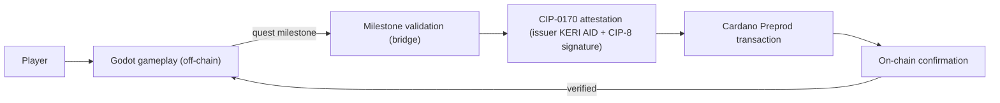

# LAB3 Godot × Cardano Game

**Play Now:** https://dmt041104111003.github.io/lab3-godot-cardano-testnet/

A playable Godot 4 game where you complete quests, build persistent progression,
and earn achievements that are **verified on Cardano**. Real Preprod transactions
happen only when you complete a meaningful milestone — gameplay stays fast and
off-chain.

---

## What the Game Is

- A top-down dungeon quest game: collect **energy fragments**, activate
  **terminals**, reach the **exit**.
- Complete 3 quests per run, earn **XP and levels** that persist on your device.
- When you finish a quest milestone, the game submits a real **Cardano Preprod**
  transaction (proof + achievement attestation) and shows you the **transaction
  hash** and **on-chain confirmation** right in the game.
- Optional: connect your own **CIP-30 wallet** (Eternl/Nami) and your attestation
  is signed by *your* wallet.

This is an end-user game with Cardano integration — not a tutorial or SDK.

## Gameplay

1. **Play** → enter the level.
2. **Quest 1:** collect 5 energy fragments.
3. **Quest 2:** activate 3 terminals.
4. **Quest 3:** reach the exit.
5. Each quest completion = an XP reward + a **milestone** that triggers the
   Cardano flow.
6. **Achievements** screen shows each quest and whether it is **Verified on
   Cardano**.

## Player Progression

- XP and level persist locally (`user://profile.json`).
- Fragments/terminals collected and quest/verification status are saved.
- Profile (name + wallet address) is set in **Player Profile**.

## Cardano Integration

- The game never holds keys. It talks to a **hosted bridge** (Node.js + Mesh SDK,
  Vercel) that signs and submits with a testnet wallet; private keys stay in
  server-side env vars only.
- Milestone → `POST /api/quest/complete` (proof, metadata label 674) → poll
  confirmation → `POST /api/attestation/prepare` + `/create` (CIP-0170
  attestation, metadata label 1701) → verify → **Verified on Cardano**.
- Explorer links open the real transactions on Cardanoscan (Preprod).

## Architecture



## Public Preprod Validation

Real transactions produced by this flow (Cardano Preprod):

| Quest | Proof tx | Attestation tx |
| ----- | -------- | -------------- |
| quest_1 | `34f6b17f77041da3e51d674de19b8727465f5376c8b9d908b46b3793c4ac2e80` | `0c00567a45b62d289915af29facc65429e4d0d9f1acd39edbd03cd9921623fc9` |
| quest_2 | *(confirm-step, see attestation)* | `99755b126d276f20eed57191882b02d7de163364a7a8822cd5924bcfc343451f` |
| quest_3 | `20a497f1cba6152aeabb8ef82a51ad3a6823062e9329a3fdb484f42fc5620d19` | `815925ee36b4e22ccdfe10a7f102d96081ed26657616d49d0f72730e2b07db4e` |

Open any hash in `https://preprod.cardanoscan.io/transaction/<hash>`.
Full evidence: [docs/evidence/README.md](docs/evidence/README.md).

## Security Model

- No seed phrases, private keys, or API secrets are committed.
- Signing happens only on the bridge (server-side env vars) or in the player's
  own CIP-30 wallet.
- `.env` is gitignored; `.env.example` documents required variables.

## Running Locally

```bash
# backend
cd backend
cp ../.env.example ../.env   # set NETWORK=preprod, MNEMONIC, BLOCKFROST_API_KEY
npm install
npm start                    # bridge on http://127.0.0.1:8787

# game
open godot/project.godot in Godot 4.x → Play
```

## Test Evidence

- [docs/evidence/README.md](docs/evidence/README.md) — evidence bundle
- [docs/testnet-validation.md](docs/testnet-validation.md) — transaction records
- [docs/TESTER_GUIDE.md](docs/TESTER_GUIDE.md) — how external testers test
- [docs/EXTERNAL_TESTING.md](docs/EXTERNAL_TESTING.md) — external tester results

## Current Product vs Planned CIP-0170 Integration

- **Current product (TRL 5):** playable Godot game + Cardano Preprod integration
  validated end-to-end (proof + attestation + verification). Full CIP-0170
  compliance (did:cardano, on-chain status registry) is **planned Pilot work** —
  the game already implements the profile → wallet → milestone → attestation →
  transaction → verification flow as an interface, ready for the full spec.
- See [docs/TRL5_EVIDENCE.md](docs/TRL5_EVIDENCE.md) and
  [docs/PROPOSAL_UPDATE.md](docs/PROPOSAL_UPDATE.md).

## License

MIT — see [LICENSE](LICENSE). Game art: Kenney CC0 (see [godot/assets](godot/assets/README.md)).