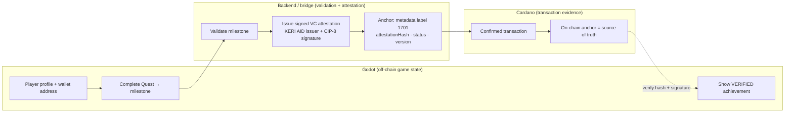
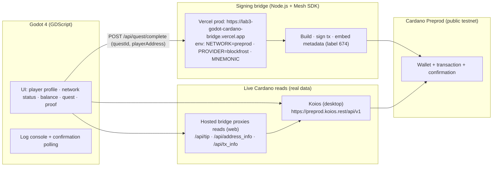

# LAB3 Godot × Cardano Testnet

A minimal but **real** Godot 4 application that connects to the **Cardano Preprod
testnet**, reads live on-chain data, lets a player complete a quest, and submits a
**real testnet transaction** carrying verifiable metadata — then shows the
confirmed transaction hash inside the app.

This is the **validated Godot × Cardano product baseline** that a future CIP-0170
integration will build on. It is **not** the CIP-0170 integration itself.

---

## ✅ What this prototype proves

> This prototype demonstrates a functional Godot application interacting with a
> public Cardano testnet environment. It retrieves live Cardano data, initiates a
> testnet blockchain interaction from a gameplay flow, receives the resulting
> transaction hash, and verifies confirmation on-chain.

## ⛔ What it does NOT prove

> The prototype does not yet implement the full CIP-0170 on-chain identity spec.
> CIP-0170 is the **new integration** built on this baseline — the core of the
> Catalyst Pilot. A working CIP-0170 attestation layer is implemented and tested
> on Preprod (see [docs/cip-0170.md](docs/cip-0170.md)); mainnet deployment is the
> Pilot milestone.

---

## Real on-chain evidence (Preprod, 2026-08-17)

Four independent testnet transactions were submitted and confirmed from this
workflow. No hashes on this page are fabricated.

| # | Transaction hash | Origin | Explorer |
| - | ---------------- | ------ | -------- |
| 1 | `30219e447faf3a89784c73f27916ee15882bdd7575478152a0d01500173e8162` | desktop bridge | https://preprod.cardanoscan.io/transaction/30219e447faf3a89784c73f27916ee15882bdd7575478152a0d01500173e8162 |
| 2 | `4a4b87a9e9b398526308c2c7ba239d0e185f0857bd22935dfae5e6d5bb00e501` | desktop bridge | https://preprod.cardanoscan.io/transaction/4a4b87a9e9b398526308c2c7ba239d0e185f0857bd22935dfae5e6d5bb00e501 |
| 3 | `7b07014ddd39cd56abfaaefa8663c2dcde0b10a0930e0724ed937eb6364b4120` | desktop bridge | https://preprod.cardanoscan.io/transaction/7b07014ddd39cd56abfaaefa8663c2dcde0b10a0930e0724ed937eb6364b4120 |
| 4 | `73aa0613c47b890de10c51849322ae25afb78c718e9f2cc8b54eb18578b415c4` | hosted Vercel bridge | https://preprod.cardanoscan.io/transaction/73aa0613c47b890de10c51849322ae25afb78c718e9f2cc8b54eb18578b415c4 |

> All four carry metadata under **label 674** (verified on-chain via Blockfrost —
> see [docs/testnet-validation.md](docs/testnet-validation.md)). TX #4 was signed
> and submitted by the **hosted bridge** — the same endpoint the browser build
> uses.

## 🎖 CIP-68 achievement NFTs (real on-chain assets)

Beyond metadata, completing a quest can now mint a **CIP-68 NFT** into the wallet:
a user token + a reference token carrying the achievement metadata as an inline
datum — viewable as an NFT in any Cardano explorer. Confirmed on Preprod:

- Policy: `2bf2c666eff15da20d4aa8cd79383ceb8d95e4b015574a8770f8c1f3`
- Latest mint (hosted bridge): `02b603705215753102d39667dff8305abdd5226b0e7887965ca3ad3810dbcef7`
  https://preprod.cardanoscan.io/transaction/02b603705215753102d39667dff8305abdd5226b0e7887965ca3ad3810dbcef7
- In the app: complete a quest, then click **Mint Achievement NFT**.

## 🪪 CIP-0170 — on-chain identity & attestation (new integration)

The Pilot's new integration. A player links their profile to a Cardano wallet;
when a qualifying milestone occurs, the backend validates the event and issues a
**signed VerifiableCredential attestation** (issuer = KERI-style AID) that is
**anchored on-chain** (metadata label 1701). Godot then verifies the on-chain
anchor + issuer signature before showing the achievement as **verified**.

Confirmed on Preprod (create v1 + update v2 + a hosted-bridge create) with
`verified: true` — see [docs/cip-0170.md](docs/cip-0170.md).



**In the app:** click **Register Identity** → **Attest Achievement** (tx anchored)
→ **Verify On-Chain** (shows `VERIFIED ✓`).

## Identity & attestation states (separated)

1. **Off-chain game state** — player profile linked to the wallet.
2. **CIP-0170 attestation** — signed W3C VerifiableCredential (issued/updated).
3. **Cardano transaction evidence** — on-chain anchor (label 1701), source of truth.

Full details: [docs/cip-0170.md](docs/cip-0170.md).

## Verify it yourself — live, right now

1. **Web build (browser)** — open the GitHub Pages build and run a real test:
   paste any `addr_test1…` address → balance shows; click **Complete Quest** →
   **Submit Testnet Proof** → a real Preprod transaction is signed by the hosted
   bridge and confirmed on-chain, then the hash appears in the app.
2. **Hosted bridge** — `https://lab3-godot-cardano-bridge.vercel.app/health`
   (live on Vercel; `/api/tip`, `/api/address_info`, `/api/quest/complete`).
3. **On-chain proof** — the real Preprod transactions below, openable in any
   Cardano explorer (metadata label 674).

> Every number in the app is fetched live from Cardano Preprod — nothing is
> simulated. The web build + explorer links are the primary proof.

---

## How it works (10-second version)

```
Browser:  Godot Web  ──reads (hosted bridge)──►  Cardano Preprod
             │  POST /api/quest/complete
             ▼
Hosted bridge (Vercel, Node.js + Mesh SDK)  ──signs + submits──►  Cardano Preprod
   │
   └──► returns tx hash ──► Godot polls chain ──► CONFIRMED + explorer link

Desktop:   Godot  ──reads (Koios)──►  Cardano Preprod
             │  submit via local bridge (http://127.0.0.1:8787) or hosted bridge
```

Godot initiates the workflow; the bridge performs the signing (native Godot cannot
reach browser CIP-30 wallets). Full detail:
[docs/architecture.md](docs/architecture.md).

---

## Architecture (renders on GitHub)



**Flow (as executed on 2026-08-17):**
1. Godot queries the chain tip → shows `preprod` + live tip height.
2. User pastes a testnet address → live balance in tADA (Koios / hosted bridge).
3. User clicks **Complete Quest** → quest flag set locally.
4. User clicks **Submit Testnet Proof** → `POST /api/quest/complete` on the bridge.
5. Bridge builds a tx with metadata (label 674), signs with the testnet wallet,
   submits to Preprod, returns the **tx hash**.
6. Godot polls the tx status every 3 s until it is in a block.
7. Godot shows **CONFIRMED (block height …)** and opens the explorer.

> Desktop reads via Koios; browser reads via the hosted bridge (CORS). Submissions
> always go through the bridge — Godot never holds the mnemonic.

---

## Repository structure

```
.
├── README.md                 ← you are here
├── LICENSE                   MIT
├── .env.example              ← template for local secrets (gitignored)
├── .gitignore
├── docs/
│   ├── architecture.md       ← system design, data flow, live deployment
│   ├── cip-0170.md           ← CIP-0170 identity & attestation (new integration)
│   ├── testnet-validation.md ← REAL executed transactions on Preprod + reproduction
│   ├── evidence.md           ← validation & evidence checklist
│   └── live-demo.md          ← deployment guide (GitHub Pages + Vercel bridge)
├── godot/
│   ├── project.godot
│   ├── export_presets.cfg    ← Web (HTML5) export preset
│   ├── scenes/main.tscn
│   └── scripts/
│       └── main.gd           ← UI + live Cardano reads + submit flow + polling
└── backend/
    ├── package.json
    ├── vercel.json           ← Vercel serverless config
    ├── api/index.js          ← Vercel entry (exports the Express app)
    └── src/
        ├── server.js         ← local dev server (127.0.0.1:8787)
        ├── app.js            ← Express app (routes, CORS, proxies)
        ├── cardano.js        ← Mesh SDK wallet / build / sign / submit
        ├── config.js         ← env + network mapping
        └── scripts/
            ├── gen-wallet.js ← generate a fresh testnet wallet
            └── fund-wallet.js← show addresses + balance + faucet guidance
```

---

## Prerequisites (clean machine)

- **Godot 4.x** — https://godotengine.org/download (any 4.x; GL Compatibility renderer)
- **Node.js 18+** — https://nodejs.org (tested with Node 20)

No Cardano node, cardano-cli, or Docker required.

---

## Setup

### 1. Clone & install backend

```bash
git clone https://github.com/dmt041104111003/lab3-godot-cardano-testnet.git
cd lab3-godot-cardano-testnet/backend
npm install
```

### 2. Configure environment

```bash
cp ../.env.example ../.env
```

Edit `../.env` (this file is **gitignored**, never commit it):

```dotenv
NETWORK=preprod
PORT=8787
PROVIDER=koios            # or blockfrost (needs BLOCKFROST_API_KEY)
# BLOCKFROST_API_KEY=preprodXXXX
MNEMONIC=<24-word testnet mnemonic>
```

- `PROVIDER=koios` works with **no API key** (public Koios).
- `PROVIDER=blockfrost` uses a free Preprod project id
  (https://blockfrost.io → create a **Preprod** project). It is more reliable for
  submission.

### 3. Create a test wallet safely

```bash
cd backend
npm run key        # prints a fresh 24-word mnemonic + addresses
```

- Put the generated mnemonic in `.env` → `MNEMONIC=...`.
- **Never share or commit the mnemonic.** It only funds testnet tADA.
- To check an existing mnemonic's addresses: `npm run fund`.

### 4. Fund the test wallet (testnet faucet)

```bash
npm run fund       # shows payment + stake address and current balance
```

If the balance is 0, use the **official Cardano testnet faucet**:

1. Open https://docs.cardano.org/cardano-testnet/tools/faucet/
2. Choose **Preprod**.
3. Paste your **stake address** (`stake_test1…`, printed by `npm run fund`).
4. Request test ADA (tADA). ~2–3 blocks later it arrives.

### 5. Start the bridge

```bash
npm start          # → [bridge] listening on http://127.0.0.1:8787
```

Check it: `curl http://127.0.0.1:8787/health`

### 6. Run the Godot app

1. Open Godot → **Import** → select `godot/project.godot`.
2. Press **Play (F5)**.
3. Paste a testnet address (`addr_test1…`) into **Wallet address**.
4. Click **Refresh Cardano Data** → live balance appears.
5. Click **Complete Quest** → then **Submit Testnet Proof**.
6. Wait for the tx hash → **CONFIRMED (block height …)**.
7. Click **Open Explorer** to verify on-chain.

---

## Environment variables

| Variable | Default | Purpose |
| -------- | ------- | ------- |
| `NETWORK` | `preprod` | `preprod` or `preview` (testnet only) |
| `PORT` | `8787` | Bridge HTTP port |
| `PROVIDER` | `koios` | `koios` (no key) or `blockfrost` |
| `BLOCKFROST_API_KEY` | *(empty)* | Preprod Blockfrost project id |
| `MNEMONIC` | *(empty)* | 15/24-word testnet wallet mnemonic |
| `LAB3_BRIDGE_URL` | `http://127.0.0.1:8787` | Godot → bridge URL (OS env override) |
| `LAB3_KOIOS_URL` | `https://preprod.koios.rest/api/v1` | Godot read API (OS env override) |
| `LAB3_NETWORK` | `preprod` | Godot display network name |
| `LAB3_EXPLORER` | `https://preprod.cardanoscan.io/transaction` | Explorer base URL |
| `LAB3_QUEST_ID` | `quest_001` | Quest id written into metadata |

Godot reads its overrides from **OS environment variables** (set them before
launching Godot) — `.env` is consumed by the bridge only.

---

## Execute a real testnet transaction (exact steps)

1. Bridge running (`npm start` in `backend/`).
2. Godot app running, a funded testnet address pasted, balance visible.
3. **Complete Quest** → **Submit Testnet Proof**.
4. Godot calls `POST http://127.0.0.1:8787/api/quest/complete` with
   `{"questId":"quest_001","playerAddress":"addr_test1…"}`.
5. The bridge builds a tx with metadata label 674, signs it with the funded
   testnet wallet, and submits it to Preprod via Blockfrost/Koios.
6. The bridge returns the **tx hash**; Godot polls `POST /tx_info` (Koios) until
   the tx appears in a block.
7. Status flips to **CONFIRMED (block height …)**; **Open Explorer** shows the
   on-chain transaction and its metadata.

Verify independently:

```bash
curl -s -X POST https://preprod.koios.rest/api/v1/tx_info \
  -H "Content-Type: application/json" \
  -d '{"_tx_hashes":["30219e447faf3a89784c73f27916ee15882bdd7575478152a0d01500173e8162"]}'
```

---

## Security

- **Never commit:** seed phrases, private keys, API secrets.
- The mnemonic and Blockfrost key live only in gitignored `.env` (local) or Vercel
  env vars (production). They are never committed.
- The bridge binds to `127.0.0.1` for local development; production runs on Vercel.
- Godot never sees the mnemonic — it only talks to the bridge.
- All activity is on Cardano **testnet** (Preprod/Preview) — testnet funds only.

## Web (browser) builds

- Browser builds read live data from **Blockfrost** (CORS-enabled) using a public
  Preprod key embedded in the build, and submit through the hosted bridge
  (`https://lab3-godot-cardano-bridge.vercel.app`) — fully functional for
  visitors with zero local setup.
- Desktop builds read from **Koios** (no key) and submit to the local bridge
  (`http://127.0.0.1:8787`) or the hosted bridge.
- The web build auto-detects the environment via `OS.has_feature("web")`.

## For reviewers — quick verification

1. Open the web build (GitHub Pages URL) in a browser.
2. Paste the bridge wallet address
   `addr_test1qp6el7vnjgr2gqd5m7dcz92uw5pwqaddpp520jgy3xvd9l4fg96w0twerwjcahs5djhttqgj5slgt9yd6xftgecum22qraq6v4`
   → the balance shows live tADA from Preprod.
3. Click **Complete Quest** → **Submit Testnet Proof** → a real transaction is
   signed by the hosted bridge and confirmed on-chain; the hash + block height
   appear in the game.
4. Click **Open Explorer** to view the transaction and its metadata (label 674)
   on `preprod.cardanoscan.io`.
5. Cross-check any hash in the explorer against
   [docs/testnet-validation.md](docs/testnet-validation.md).

---

## Docs

- [architecture.md](docs/architecture.md) — system design & data flow
- [cip-0170.md](docs/cip-0170.md) — CIP-0170 identity & attestation (new integration)
- [testnet-validation.md](docs/testnet-validation.md) — real Preprod transactions
- [evidence.md](docs/evidence.md) — validation & evidence checklist
- [live-demo.md](docs/live-demo.md) — deployment guide (GitHub Pages + Vercel bridge)

## License

MIT — see [LICENSE](LICENSE).